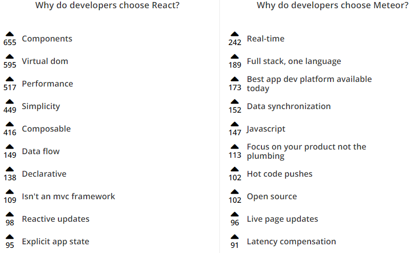

# Meteor vs React

## Inhoud
- [Waarom?](#waarom)
- [Meteor](#meteor)
- [React](#react)
- [Meteor vs React](#meteor-vs-react)
   - [Wie gebruikt wat?](#wie-gebruikt-wat)
   - [Aanpassingen van Data](#aanpassingen-van-data)
   - [Voordelen van Meteor](#voordelen-van-meteor)
   - [Nadelen van Meteor](#nadelen-van-meteor)
   - [Voordelen van React](#voordelen-van-react)
   - [Nadelen van React](#nadelen-van-react)
   - [Performance](#performance)
- [Conclusie](#conclusie)
- [Resources](#resources)

 

## Waarom?
Ik ben met de new technology meer over Meteor te weten gekomen, en wilde dus de vergelijking maken met React, een Javascript framework waar ik al bekend mee ben. Achteraf gezien niet de beste keuze misschien, aangezien Meteor een full-stack framework is, terwijl React eigenlijk een front-end framework (officieël gezien een library). Het gaat dus ook deels over Blaze (Meteor's standaard) vs React.

 

## Meteor
Meteor, of MeteorJS, is een *isomorphic* (zowel client als server) open-source Javascript framework geschreven met Node.js. Meteor is makkelijk te gebruiken voor snelle prototyping en creërt cross-platform code (Android, iOS, Web). Het intergreert MongoDB en gebruikt een zogenaamd Distributed Data Protocol, waardoor veranderingen in data automatisch gesynchroniseerd worden zonder enige code van de developer.
Meteor is een full-stack framework, wat wil zeggen dat het zowel de front-end als back-end verzorgd. Het gebruikt een mix van front-end Javascript dat in de browser runt, en back-end Javascript dat op een Meteor server runt. Je kan  Meteor op zich zelf gebruiken (met Blaze als standaard templating engine), of in combinatie met Angular, React, Vue.

 

## React
React, of ReactJS is officieel gezien een Javascript library, maar wordt vaak als front-end framework gezien, omdat het concureerd met Angular en Vue. Het is gemaakt door Facebook en wordt veel gebruikt voor de V in MVC (Model, View, Controller). Het is de basis van single-page of mobile apps en is speciaal ontworpen voor het maken van user interfaces. Het heeft dus niet veel hulpmiddelen die je als developer misschien noodzakkelijk acht om een applicatie te maken. Als je complexere applicaties wilt maken heb je extra libraries nodig voor state management, routing en API interactie. Hierdoor kan je wel met eender welke library werken die je voorkeur heeft om bepaalde taken uit te voeren.

 

## Meteor vs React
### Wie gebruikt wat?

 
 

Zoals je kan zien wordt React op het moment door meer en grotere bedrijven gebruikt. Waarom is dat zo? Votes op [stackshare.io](https://stackshare.io/stackups/meteor-vs-react) laten het volgende zien:

 
 

 

### Aanpassingen van Data
React's aanpak van het doorgeven van data veranderingen is anders dan bij Blaze (Meteor). Blaze gebruikt een tracking systeem om bij te houden welke delen van het DOM overeenkomen met welke delen van de UI state. Dit betekent dat wanneer de status wijzigt (bijvoorbeeld het verwijderen van een e-mail), het exact weet welke DOM-elementen gewijzigd moeten worden. Blaze gebruikt hiervoor jQuery om dit direct aan te passen. Updates gaan van de gebeurtenis naar andere plaatsen die gewijzigd moeten worden. Hoewel deze architectuur het intuïtief maakt om te begrijpen wat opnieuw gerenderd wordt bij een wijziging, wordt de oorsprong van wijzigingen onvoorspelbaar in een grote app met onderling afhankelijke variabelen.

React gebruikt een eenvoudig systeem dat virtual DOM wordt genoemd. Het is een stamboom met React-componenten, die elk een eigen staat hebben en die van de ouders bevat en overeenkomt met echte DOM-elementen. Updates stromen altijd omhoog in de componenthiërarchie en vervolgens omlaag naar de relevante knooppunten. Bij het wijzigen van de state worden alle elementen die om die status geven gewijzigd. Dit betekent dat hierdoor een groot aantal niet-gerelateerde elementen kunnen worden gewijzigd. Het diff-algoritme van React beperkt echter niet-gerelateerde wijzigingen door de minimaal mogelijke virtuele DOM-aanpassingen te berekenen die nodig zijn om de verandering in UI-status te bereiken. Pas daarna wordt het echt DOM aangepast.

| Blaze | React |
| --- | --- |
|  |  |

 

### Voordelen van Meteor
+ Makkelijk leercurve.
+ Intergratie tussen front-end en back-end, dus je bent klaar als je enkel Meteor gebruikt.
+ Uitstekende keuze voor back-end, zeker als beginner.
+ Meteor is een applicatie framework dat geweldig is als je alleen in Javascript wilt schrijven, omdat het zowel server-side als client-side Javascript toestaat, en de twee mixt.
+ Het is ideaal als je een realtime applicatie maakt met een complexe user interface.
+ Meteor support cross-platform mobile builds (Android, iOS) wat het een ideaal en populair framework maakt voor snelle prototyping.
+ Een van de grote sterktes van Meteor is hoeveel het voor je doet. Voor hele kleine of hele grote projecten is het soms gewenst om alles zelf te doen, maar voor gemiddelde projecten is er over het algemeen een goed argument te maken om Meteor te gebruiken.

 

### Nadelen van Meteor
- Meteor is een back-end client dat draait op Node, dus terwijl React gelijk in je browser runt, heeft Meteor wat setup en een server dat Node en MongoDB runt nodig.
- Als je al een bestaande applicatie hebt, is het switchen naar Meteor niet erg makkelijk aangezien de core logica opnieuw gecode moeten zullen worden. Als je een nieuwe app maakt, is Meteor wel een goede keus.
- Meteor is niet ideaal voor een kleine business site, doordat het wat problemen heeft qua SEO (search engine optimazation).
- Meteor's focus op real-time applicaties maakt het super gemakkelijk om iets maken ten opzichte van andere platformen, maar het gaat ten koste van verborgen complexiteit. Wat dit wil zeggen is dat hoe dieper je in Meteor gaat, hoe sneller het heel snel complex kan worden, en daarmee ook potentieel performance problemen met zich mee zal brengen.
- Gelimiteerde databses. Meteor is alleen voor MongoDB, en niet elke app zou op MongoDB moeten runnen. Als je gewoon wat documenten wil bewaren is MongoDB prima, maar anders gebruik je liever zoiets als MySQL.
- Het deployen van Meteor is niet geweldig. Meteor biedt zelf deployment aan (Galaxy), maar daarin zijn ze veel te duur voor bijvoorbeeld een startup. Professional begint bij bijna $500 per maand. Ter vergelijking, Heroku is ergens rond de $100 of minder. Je zou de applicatie ook kunnen deployen op Digital Ocean, maar daar heb je speciale tools voor nodig, en die ervaring schijnt ver van prettig te zijn.
- Intergratie tussen front-end en back-end, hoewel ook een voordeel, kan ook een nadeel zijn.

 

Quote van [Discover Meteor](https://www.discovermeteor.com/blog/the-state-of-meteor-part-1-what-went-wrong/)

*From the start, the Meteor Development Group has viewed Meteor as a platform: they’d give developers a toolbox, some screws, and a bunch of wooden boards, and developers would then use these tools to build whatever they wanted, however they wanted.  
This explains why MDG left things like file structure, routing and forms to the community. Even though these are key part of nearly every single web app out there, they’re framework-level components, not platform-level.*

 

### Voordelen van React
+ Ondersteund door Facebook.
+ Door het gebruik van veel packages heb je wel keuze in welke package en wat je wel en niet wilt gebruiken.
+ React is vooral 'plug & play' en kan gebruikt worden zoals je zelf wilt, en is vooral handig voor het beheren van de UI state.
+ Je kan één component van je website maken via react als die veel states afhandeld (bijvoorbeeld navigatie, forms, popups, etc). Dit zou kunnen helpen om processen te versnellen en de site betere prestaties te geven. Het zou ook veel gemakkelijker te onderhouden zijn, omdat de presentatielogica en scripting niet gekoppeld zouden zijn aan de DOM, wat meestal het geval is bij het schrijven van Javascript of jQuery.
+ Aangezien React geen veronderstelling maakt over de rest van de applicatie, is het makkelijk om het uit te proberen op een een feature in een bestaand project.
+ Het grote voordeel van react is dat je herbruikbare UI components kan maken.

 

### Nadelen van React
- Geen makkelijke leercurve, gebruikt ook JSX.
- Relatief veel RAM nodig, doordat React met de virtual DOM werkt. Dat wil zeggen dat reprensentatie van de UI in het geheugen zit, die gesynchroniseerd wordt met het 'echt' DOM door een library zoals reactDOM.
- Weinig hulpmiddelen zitten er standaard in, dus moet je veel packages gebruiken.

 

### Performance
Aan de developer kant qua presetaties heb ik persoonlijk wel gemerkt dat het opzetten van een Meteor project erg traag is. Ook als je eenmaal een Meteor app hebt aangemaakt duurt het lang om deze op te starten, elke keer weer opnieuw. Dit is bij gewoon een pure React app veel sneller en beter. Maar goed, dit is wel enigsinds te verwachten aangezien het over een full-stack framework gaat, t.o.v. een front-end library waar je nog veel packages voor moet downloaden. Het verschil tussen een Meteor & Blaze of een Meteor & React app is niet te merken.

Qua site prestaties zou je verwachten dat React's aanpak van het veranderen van data via de component stamboom enorm inefficiënt zou zijn, i.p.v. het direct veranderen van componenten die een update nodig hebben. In het het voorbeeld hieronder, zouden er veel meer componenten veranderen dan bij Blaze het geval zou zijn. De performance is echter goed door de snelheid van het virtual DOM. Twee belangrijke aspecten daarin zijn:
- DOM veranderingen zijn redelijk voorspelbaar.
- Componenten stambomen zijn nooit heel groot.

Met andere woorden, het DOM is zo traag dat de Javascript die runt niet eens echt meespeelt in de performance vergelijking.

 

| Voor | Na |
| --- | --- |
|  |  |

  

**Rendering times**

*Source: [blog.meteor.com](https://blog.meteor.com/comparing-performance-of-blaze-react-angular-meteor-and-angular-2-with-meteor-c650c913d3f8)*

We gaan meten met een script hoe lang het duurt om een X aantal list items te laten renderen via Meteor met Blaze, of via Meteor met React.
Bij de grafiek hier onder zien we dat pas bij het aanmaken van 5000 list items of meer er echt grote verschillen ontstaan.

  

Wanneer we de list items opnieuw renderen zijn de verschillen pas groot aan het worden bij 10.000 list items. Wat dit wil zeggen is dat als er bijvoorbeeld 15.000 list items zijn aangemaakt, 10.000 hiervan moeten geüpdate worden. Als je een applicatie hebt die zo veel items moet renderen in de browser is er een groter probleem dan het kiezen van het framework.

 

  

## Conclusie
Performance is belangrijk, maar niet het belangrijkste voor het kiezen van een framework. Zowel Blaze als React zijn goed genoeg qua prestaties. De keuze gaat meer over de voorkeur van je coding style en de community erom heen (package aanbod).
Meteor zelf is erg handig voor snelle prototyping, maar is niet erg handing als je de applicatie echt gaat uitwerken. Er is geen goede SEO, moeilijker om te deployen en gelimiteerd aan MongoDB. React is anderzijds iets moeilijker om mee te beginnen, maar eenmaal je er handig mee bent, kent React bijna alleen maar voordelen.

  

## Resources
- Quora: should I use Meteor, Angular or React
  - https://www.quora.com/Should-I-use-Meteor-Angular-or-React
- Quora: when should you use React or Meteor?
  - https://www.quora.com/When-should-you-use-React-or-Meteor
- Quora: which technology is better for mobile apps?
  - https://www.quora.com/Which-technology-is-better-for-creating-mobile-apps-React-Native-or-Meteor
- Stackshare: Meteor vs React
  - https://stackshare.io/stackups/meteor-vs-react
- Discover Meteor: state of Meteor - what went wrong
  - https://www.discovermeteor.com/blog/the-state-of-meteor-part-1-what-went-wrong/
- Youtube: Meteor vs React
  - https://youtu.be/6NsZGyK1p7s?t=154
- Reactive User Interfaces
  - http://blog.percolatestudio.com/engineering/reactive-user-interfaces/
- Comparing Performance of Blaze (default) and React with Meteor
  - https://blog.meteor.com/comparing-performance-of-blaze-react-angular-meteor-and-angular-2-with-meteor-c650c913d3f8
- Stackoverflow: why should sone use React with Meteor
  - https://stackoverflow.com/questions/28962602/why-should-one-use-react-with-meteor
- Reddit: Is Meteor.js Dying? Where are people moving to?
  - https://www.reddit.com/r/javascript/comments/672nrk/is_meteorjs_dying_where_are_people_moving_to/
- Youtube: Framework debate
  - https://www.youtube.com/watch?v=p9-nfFIg8vk
- Wikipedia: Meteor
  - https://en.wikipedia.org/wiki/Meteor_(web_framework)
- Wikipedia: React
  - https://en.wikipedia.org/wiki/React_(JavaScript_library)